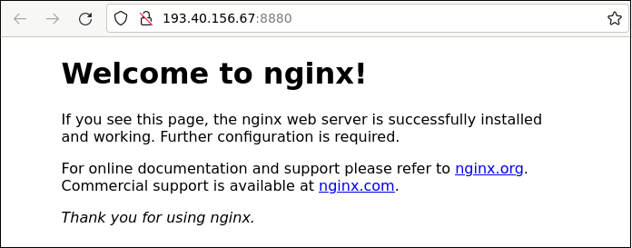

# Lab 2

## Task 1

Ansible logs in to your managed host as unprivileged user `ubuntu`; this user was enough so far to
run the basic checks on the host as you did in the [lab 1](../01-intro) with `ansible.builtin.ping`
module.

However most of the following tasks (creating users, installing packages, restarting services etc.)
are not permitted for regular users, and require privilege escalation. There are several ways how to
get the needed permission on the Linux host (`su`, `sudo` etc.), so the Ansible method to do it is
called neutrally: `become`.

There are several places where `become` can be used:
 1. `become: true` parameter to added to every task that requires privilege escalation -- this is
    the most granular but also the most complex method;
 2. `become: true` parameter can be added to every _play_ that contains roles or tasks that require
    privilege escalation -- less granular, but also involves significantly less typing;
 3. `ansible_become=true` can be added to the host parameters in the inventory file;
 4. Ansible can be configured to always attempt to become `root` on the managed host for every task.

We'll go with the method 4 for simplicity. For this, add the `privilege_escalation` section to your
`ansible.cfg` file as shown below:

    [defaults]
    inventory = ./hosts

    [privilege_escalation]
    become = true

More info about privilege escalation in Ansible can be found
[here](https://docs.ansible.com/ansible/latest/playbook_guide/playbooks_privilege_escalation.html).

Self check:
 - You can check if your solution is working in the next task -- it won't work without correctly
   setup `become`.

## Task 2

Update the Ansible role named `init` you created in the lab 1 and add the tasks that create two more
Linux users on your managed host:
 - `juri` (GitHub username: `hudolejev`)
 - `roman` (GitHub username: `romankuchin`)

Set up key based authentication for these users; their public keys can be found in GitHub.

Check out the documentation of these Ansible modules to find out how to do it:
 - [user](https://docs.ansible.com/ansible/latest/collections/ansible/builtin/user_module.html)
 - [authorized_key](https://docs.ansible.com/ansible/latest/collections/ansible/posix/authorized_key_module.html)

Note: don't use any `lookup()` methods for this task. Keep it simple!

Comment out the `Ansible ping module` task in the `init` role -- we won't need it further:

    #- name: Ansible ping module
    #  ansible.builtin.ping:

`infra.yaml` playbook is already configured to apply the `init` role to all your servers; run it:

    ansible-playbook infra.yaml

This should create the users on the managed hosts, and authorize their SSH keys, all in one run.

Self check:
 - SSH to your managed host
 - Ensure that the file `/home/juri/.ssh/.authorized_keys` exists and contains the keys from
   https://github.com/hudolejev.keys
 - Ensure that the file `/home/roman/.ssh/authorized_keys` exists and contains the keys from
   https://github.com/romankuchin.keys

Self check here can be done manually, you don't have to use Ansible for that. File content can be
printed using `cat` or `less` commands.

## Task 3

Most services we set up later in this course are installed from APT respositories, which is a
de-facto standard way to install the software on Debian based Linux distributions (also Ubuntu).

You may have seen tutorials in the internet suggesting to install the package as

    apt-get update
    apt-get install {pkg}

The first command, `apt-get update`, does not install anything but only updates the local APT cache:
it downloads the list of the available packages (name and some metadata, not the package itself)
from the remote APT repository and stores it in the local filesystem. Later `apt-get install` (or
the Ansible `apt` module) will not search for the package in the remote repository but will use the
local cache instead to locate the package name, URL, resolve dependencies, and will only contact the
remote repository to download the package installation files. This is done for better performance.

_Note that this behavior is APT specific; other package managers (for example, YUM or DNF on RedHat
based systems) act differently._

We don't need to update the local APT cache every time we install the new package. Not only will
this make our infra provisioning very slow, but will also cause unneeded load on the remote
repository servers. In our setup it is enough to update the APT cache one time per day.

Add the task that updates the APT cache to your `init` role:

    name: Update APT cache
    ansible.builtin.apt:
      cache_valid_time: 86400

`cache_valid_time: 86400` means that Ansible should not attempt to refresh the cache within 86400
seconds, which is 24 hours.

Self check:
 - You can check if your solution is working in the next task -- it won't work on the freshly
   created VM without updating the APT cahce.

## Task 4

Create an Ansible role named `nginx` that installs and configures Nginx web server. Use Ansible
module [apt](https://docs.ansible.com/ansible/latest/collections/ansible/builtin/apt_module.html)
to install the package from the Ubuntu APT repository; find the exact package name using a search
form here: https://packages.ubuntu.com (in the search form itself select distribution `jammy`).

 - Do not set the `update_cache` parameter for the `apt` module! It is not needed if you did the
   previous task correctly.
 - Do not change the port Nginx is listening on! By default it's 80, and custom port in your public
   URL is already set up to forward to port 80 on your managed host.

Update your Ansible inventory file from the lab 1 and add the `web_servers` group. It should contain
the single host -- your VM [from your page](http://193.40.156.67/students.html). Example:

    elvis-1  ansible_host=... ansible_port=... ansible_user=...

    [web_servers]
    elvis-1

Update the `infra.yaml` playbook and add a play named `Web server`. This will set up a web server
on your managed host. Use the `Initial setup` play as an example

This play should run on every host from `web_servers` group, and apply the role `nginx` to them:

    hosts: web_servers
    roles:
      - nginx

Run the Ansible to apply the changes:

    ansible-playbook infra.yaml

Self check:
 - Default Nginx index page should be accessible on the
   [public URL assigned to you](http://193.40.156.67/students.html)

Example:

It's good enough for now. On the next classes we'll take a closer look on what the web server is,
and how to configure and use it.

## Expected result

Your repository contains these files:

 - `ansible.cfg`
 - `hosts`
 - `infra.yaml`
 - `roles/nginx/tasks/main.yaml`

Nginx is installed and configured on empty machine by running exactly this command exactly once:

    ansible-playbook infra.yaml

Users `juri` and `roman` can SSH to that machine using their SSH keys.

Running the same command again does not make any changes on managed host.

Default Nginx index page is served on [your public URL](http://193.40.156.67/students.html).
