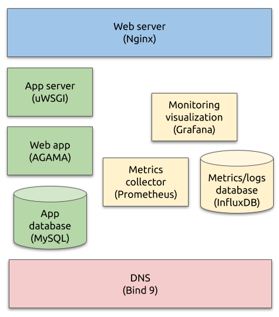

# Lab 9

The goal of this and the next lab is to configure the backups for your infrastructure.

In this lab we'll prepare the backup documentation and set up the connection with the backup server.

In the next lab we will set up automatic backups themselves, and improve the documentation
accordingly.

## Current infrastructure

This is what we have built so far:

Teachers have also prepared a backup server for you. It is located in the same network with all your
virtual machines, so consider it an _on-site_ resource. See task 1 for more details.

For simplicity you can assume that all the data from this server is also copied to another storage
outside of our infrastructure perimeter, and whatever backup you'll upload to this server will also
get an _off-site_ copy automatically -- so you don't need to worry about the `-1-` part of the
`3-2-1` rule.

## Task 1

Configure your DNS server to resolve the backup server name in your domain.

Backup server IP address is `192.168.42.132`. Note that this address may change in future, so do not
hard-code it in DNS zone file but store as the Ansible variable instead.

Once done, each of your virtual machines should be able to resolve backup server name. You can check
it by running this command on any of your VMs (replace `foo.bar` with your domain you have set up in
[lab 5](../05-dns-server)):

    host backup.foo.bar.

You should receive something like this in response:

    backup.foo.bar has address 192.168.42.132

## Task 2

Backups will be uploaded from your managed hosts to the backup server over SSH. More details will be
provided in the next lab, but first we'll need to get this SSH connection working. Of course we'll
use SSH keys (not passwords) for user authentication.

For that we'll need a separate user account on every managed host, and also a few more SSH keypairs.

**Remember -- different users should have different private SSH keys!**

Update Ansible role `init` and add the tasks that will
 1. Create a user named `backup` on every managed host
 2. Generate a new SSH key pair for this user

Requirements:
 1. User `backup` home directory should be `/home/backup`
 2. User `backup` public SSH key should be located at `/home/backup/.ssh/id_rsa.pub`

Note that there may be user named `backup` created already on the managed host so you will need to
modify it to match the requirements above. Your Ansible code will be the same for both cases.

Make sure to generate a **new** keypair for the user `backup`; Ansible module
[user](https://docs.ansible.com/ansible/latest/collections/ansible/builtin/user_module.html)
has an option to do it automatically -- check the module documentation.

**DO NOT upload YOUR OWN SSH private key (used for GitHub) to managed hosts!**

If you feel that SSH keys are still unclear topic for you please refer to
[lecture 2 slides](../02-toolchain) that covered it.

Once done, run Ansible to apply the changes:

    ansible-playbook infra.yaml

You can focus on the next task so far, and check the result later.

## Task 3

Add backup server SSH key to the list of known hosts for user `backup`.

Backups server public key is

    ssh-ed25519 AAAAC3NzaC1lZDI1NTE5AAAAIEu6pFFWyuRrl4WGFPQGElYN9txwTGm2wSntcpVAaN90

You can check it by running any of these comman on your managed host (you should see the same key
printed):

    ssh-keyscan -t ed25519 backup
    ssh-keyscan -t ed25519 backup.<your-domain>

Add this key to the `/home/backup/.ssh/known_hosts` file; this file should be owned by user
`backup`, group `backup`, and its template in Ansible repository should contain these three lines:

    {{ backup_server_ip }} {{ backup_server_ssh_key }}
    backup {{ backup_server_ssh_key }}
    backup.{{ domain }} {{ backup_server_ssh_key }}

Adjust the variable names as needed. Yes, this file is allowed to contain IP address, but this
should come from the variable!

This will "acknowledge" the backup server key for the user `backup`: with `known_hosts` file added
as described above user `backup` will be able to establish the SSH connection with the backup server
without asking to verify the server key.

## Task 4

Once the user is created and SSH keypair is generated for it (task 2) the public key will be
authorized on the backup server automatically within some time (usually 15 minutes). A separate
account will be created for your backups, account name will match your GitHub username.

Once the key is authorized on the backup server the `backup` user you've just created should be able
to log in there. You can test it by running this command manually on the managed host:

    sudo -u backup ssh <your-github-username>@backup.<your-domain> id

Example for GitHub username `elvis` and domain `demo.tld` (modify for your names accordingly):

    sudo -u backup ssh elvis@backup.demo.tld id

Note that user account names are different:
 - on your managed host (which is only yours) it is `backup`
 - on the backup server (which is a shared resource) it matches your GitHub username

If the key was authorized successfully you should get something like this in response:

    uid=1042(elvis) gid=1042(elvis) groups=1042(elvis)

Numbers will be different but the username should match your GitHub username.

If you are getting this prompt:

    The authenticity of host 'backup (192.168.42.132)' can't be established.
    ECDSA key fingerprint is SHA256:38L1IHYS4QwFRgaAeynjaOlHjf4LPjElh8aBtSgy68c.
    Are you sure you want to continue connecting (yes/no/[fingerprint])?

it means that you didn't add the backups server key correctly. Although accepting the key manually
may seem a simple solution, please don't do it -- it'll hide the problem instead of solving it, and
prevent your backups from working automatically later. Please go back to task 3 and fix your
solution -- user `backup` should be able to lo in to the backup server
**without any interactive prompts**.

If you are getting this error:

    Permission denied (publickey).

then please
 1. make sure you are running the command from the correct server: your managed host
 2. make sure you are running the command as the correct user: `backup`
 3. make sure that user `backup` home directory is `/home/backup`: can be checked with `echo ~backup`
 4. make sure that `/home/backup/.ssh/id_rsa.pub` file is there
 5. if the problem is still there, contact the teachers for help

## Task 5

Copy [backup_sla.md](./backup_sla.md) file to the root of your Ansible repository. This file
describes backup approach for MySQL, InfluxDB and Ansible Git repository.

Plan the backup schedule and restore process for your infra, calculate the retention, RPO and RTO
values, and fill the blanks in the `backup_sla.md`. Don't worry if you are not sure in some numbers
yet -- you will have a chance to adjust them on the next lab.

Note that you don't need to backup _each and every_ service. In case of disaster recovery it makes
more sense to re-create some service from scratch than restore it from the backup (Nginx, AGAMA,
Grafana, Bind). But for other services backups are must (MySQL and InfluxDB contain data that cannot
be restored with Ansible).

If you are missing some information to complete backup documentation (list of responsible IT staff,
amount of data, value of information, acceptable data loss) -- make it up (for this class)! We're
operating in the lab environment, so be creative, but try to keep it adequate and somewhat related
to real life.

Ansible Git repo mirroring is already set up. Ask teachers for details about the schedule.

## Expected result

Your repository contains these files and directories:

    ansible.cfg
    backup_sla.md
    infra.yaml
    roles/init/tasks/main.yaml

Your repository also contains all the required files from the previous labs.

Backup user is configured as required on every your managed host by running this command:

    ansible-playbook infra.yaml
